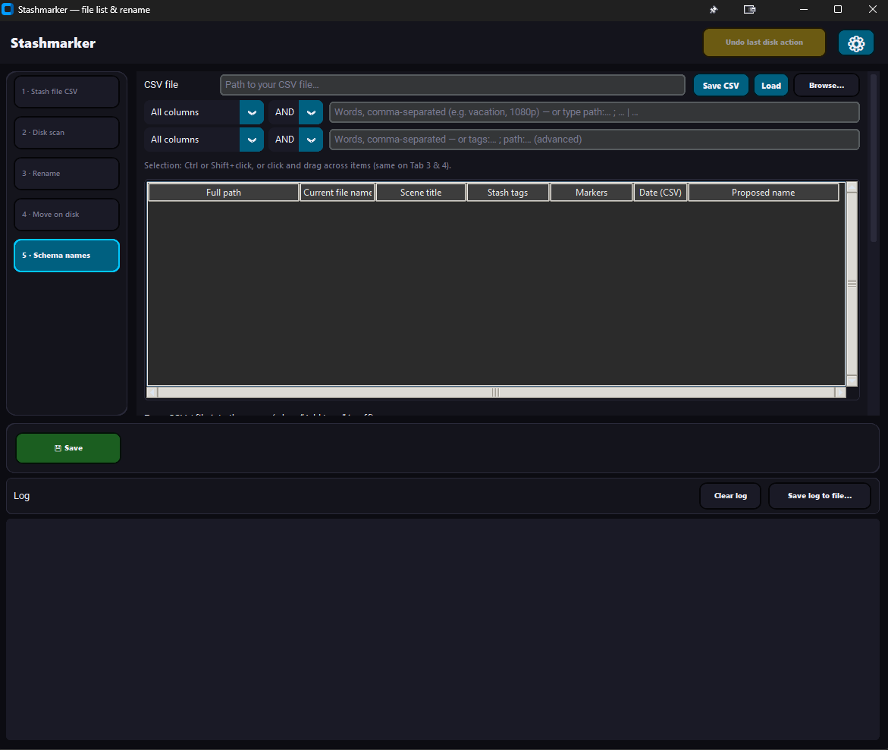

# Stash — file list & batch rename

Small helper around **[Stash](https://github.com/stashapp/stash)**: export file paths (or scan a folder), edit names in a CSV or in the GUI, then rename or move files on disk.

**Main idea:** keep your library **structured on disk** by putting **relevant scene data into the file name** (title slug, year, short tag slots, resolution, rating) instead of relying only on the database or long paths. Tab 1–2 produce a **single CSV** you can filter and work through; Tab 3 applies manual or generated names; Tab 4 moves files into folders; **Tab 5** fills **“new file name”** from a **schema** so names stay consistent across many files.

**Tab 1** talks to your running Stash instance via GraphQL (same idea as the Stash web UI): it fetches file paths linked to scenes and saves them as CSV. For Stash login, API key, and setup, see the [Stash documentation](https://docs.stashapp.cc) and the [Stash repository](https://github.com/stashapp/stash).

**Important — keep the database in sync:** If you rename or move files **outside** Stash (e.g. with this tool), paths stored in Stash no longer match the disk. Run **Tasks → Scan** (library scan) in Stash afterward so entries match the files again. Do **not** run **Clean** before Scan if you want to keep your media.

## Screenshot

Sidebar navigation, status line, and **⚙ Settings** (language, theme, CSV separator, Stash URL / API / GraphQL). Appearance depends on your saved settings.

## Quick start

### Run from source (Python on Windows)

- **Python 3** and **PowerShell** (Windows).
- **Install runtime dependencies:** run **`install.bat`** in the repository root. It upgrades `pip`, then installs **`requirements.txt`** (e.g. CustomTkinter). It does **not** install PyInstaller or other build-only tools.
- Alternatively: `python -m pip install -r requirements.txt`
- **Start the app:** **`start_file_tools.bat`** (runs `python gui_file_tools.py` from this folder) or run `python gui_file_tools.py` yourself after installing dependencies.
- **Optional for Tab 5 resolution:** install **FFmpeg** and ensure **`ffprobe`** is on **`PATH`**.

### Versioning and releases

- **Version string:** edit **`app_version.py`** (`APP_VERSION`). That value appears in the **window title** (after the translated app name), in **Settings**, and in the **GitHub Actions** artifact name (`Stashmarker-<version>-Windows`).
- **Ship a build:** run **`build_exe.bat`**, then attach **`dist/Stashmarker.exe`** to a GitHub Release (or distribute it directly). Maintainers can use **Actions → “Build Windows exe”** to download the versioned artifact without a local PyInstaller install.
- After changing **`mklocales.py`**, run **`python mklocales.py`** before tagging a release so **`locales/*.json`** stay in sync.

### Build the Windows `.exe` (optional)

There is **no guaranteed pre-built binary in this repo** (GitHub Releases are optional). To build **`Stashmarker.exe`** yourself:

1. Install **Python 3.10+** and ensure **`python`** is on **`PATH`**.
2. Run **`build_exe.bat`** in the repository root. It installs **`requirements.txt`** and **`requirements-build.txt`**, then runs **PyInstaller** with **`packaging\stashmarker_onefile.spec`** and writes **`dist\Stashmarker.exe`** (one-file bundle, **no console window** — windowed GUI only).
3. Copy **`Stashmarker.exe`** wherever you like. On first run it creates **`gui_file_tools_settings.json`**, **`schema_rename_presets.json`**, and **`file_tools_csv\`** next to the `.exe` (same behaviour as running from source, where those files are created next to the script or project folder depending on how you launch). The export script **`export_stash_files.ps1`** is **inside** the `.exe`; if your settings file still points to an old path from a dev install, the app resets Tab 1 to the bundled script when that path is missing.

**UI notes:** List filters are debounced while typing; Tab 3–5 support click-drag (including edge auto-scroll) for contiguous row selection. Tab 5 uses compact tag slots and ffprobe next to resolution options; Explorer stays in the right-click menu on lists.

**Tab 2:** Scan a folder on disk (no Stash), same CSV shape as Tab 1.  
**Tab 3:** Load CSV, search + exclude filters, edit **new file name**, optional dry run, then rename on disk.  
**Tab 4:** Move filtered/selected items into one target folder (optional subfolder). Only the **filesystem** changes; Stash is **not** updated via the API. After moving, run **Tasks → Scan** in Stash. Options: **per-source-folder** subfolders, **selected items only** vs all search matches, **Preview only** to log planned moves.

List quality-of-life on Tabs 3/4/5:

- Click any table header to sort (click again toggles ascending/descending).
- Right-click selected item: open in Explorer and copy **folder path** (without file name).

### Tab 5 — schema-based names (structure in the filename)

Longer reference text (formerly shown in the app) lives in **[docs/tab5_explanation.md](docs/tab5_explanation.md)**.

Tab 5 is for **batch-generating leaf file names** from Stash/CSV fields so **metadata lives in the name**, not only in Stash:

- **Base:** scene **title**, truncated to a max length (default 15); if the title is empty, the current **file name** is used — **not** Stash tags or markers as the main stem.
- **Protect tags** (checkbox): off — shortening can hit the whole stem including `[…]`; on — only the title before `[…]` is shortened, bracket blocks stay for you to work with.
- **Add tags** (checkbox; DE *Tags dranhängen*): off — name is rebuilt from CSV options; checked slots below **replace** old bracket tags when those slots are used. On — checked slots below are **added** to the current name when used (see the hint under the checkbox).
- **Year:** optional, from CSV when available, otherwise from file timestamps (creation where supported, else modification).
- **Up to five optional `[…]` slots:** map to scene tag names or fixed text you choose (checkboxes + text per slot).
- **Resolution:** optional via **ffprobe** on the file (e.g. height-based `1080p`); requires `ffprobe` in `PATH`.
- **Rating:** optional from Stash when present in the export.

Workflow: load the same CSV as on Tab 3 (re-export with **`export_stash_files.ps1`** / Tab 1 if you need the extra columns), filter items, tune the schema, **Fill “new file name” from schema**, then **Rename** like Tab 3. **Presets** (your patterns) are stored in **`schema_rename_presets.json`** next to the app — that file is **local only** and listed in `.gitignore` so nothing personal is published.

For already-renamed files: enable **Add tags** (*Tags dranhängen*) so checked tag slots below are added to the current name (see the short hint under that checkbox).  
Per-row manual fix: right-click in Tab 5 and use **Edit scene title (selected)**.

`scene_tags` and `scene_markers` remain in the CSV for the table and search (`tags:` / `markers:` filters on Tab 3–5).

## Stash export check (Tab 1)

On **Tab 1**, **“Check CSV export”** sends the same `findScenes` shape as `export_stash_files.ps1` (one page). If it succeeds, your Stash version still supports building the export CSV. It does **not** test moving files or updating paths inside Stash.

CSV is **UTF-8 with BOM** (Excel-friendly, accents preserved).

## Languages

The GUI supports **English, German, Spanish, and French**. Choose the language under **⚙ Settings** (stored in your local settings file, not in the repo). Strings are generated from `mklocales.py` into `locales/*.json` — after editing `mklocales.py`, run `python mklocales.py` before committing.

## Recent changes (high level)

- **Release prep:** `app_version.py` centralizes **`APP_VERSION`** (window title, Settings, CI artifact name); `requirements.txt` / `requirements-build.txt` use conservative upper bounds; Tab 6 dedupe has optional **tag-priority** checkbox; Tab 7 can load selection into Tab 5; `tab7_tab5_buffer.csv` is gitignored.
- **Tab 5** copy and layout: short labels **Protect tags** / **Add tags**, conditional hint text under **Add tags**, and the protect-tags hint on the same block as **Title max.** Locales live in `mklocales.py` → `python mklocales.py`.
- **Light mode:** checkbox and radio colors in `themes/blue_soft.json` are easier to see when checked.
- **Tab 5** schema rename: title/year/slots/resolution/rating → **new file name** column; presets in local JSON.
- **UI refresh:** cleaner/slimmer layout (less clutter), ffprobe placement improved, and softer blue accents in light/dark mode.
- **Tab 3 / Tab 4 / Tab 5:** search field plus **exclude** filter for the item list.
- **Tab 4** only moves files on disk; it does **not** call Stash’s GraphQL API to rewrite paths. After moves, use **Tasks → Scan** in Stash when those files were already in the library.
- **Locales:** four languages; settings for appearance, CSV separator, Stash URL / API key / GraphQL path (Tab 1 export and checks).

## Privacy / what not to commit

Do **not** commit:

- `gui_file_tools_settings.json` — Stash URL, API key, paths, language  
- `schema_rename_presets.json` — your rename presets and tag text  
- exported CSVs under `file_tools_csv/` — media paths  

All `*.csv` files anywhere in the tree are ignored so path lists are harder to commit by mistake (force-add only if you intentionally ship a sample).

## Files (overview)

| File | Role |
|------|------|
| `gui_file_tools.py` | GUI (CustomTkinter) |
| `app_version.py` | Release **`APP_VERSION`** (title, Settings, CI artifact name) |
| `file_rename_tools.py` | CSV & rename logic |
| `export_stash_files.ps1` | Export Stash → CSV |
| `apply_stash_file_renames.ps1` | Rename from CSV (CLI) |
| `requirements.txt` | Runtime Python deps (CustomTkinter, etc.) — used by **`install.bat`** and **`build_exe.bat`** |
| `install.bat` | Upgrade `pip`, install **`requirements.txt`** only (runtime / GUI) |
| `start_file_tools.bat` | Windows launcher: `python gui_file_tools.py` from repo root |
| `build_exe.bat` | Install **`requirements.txt`** + **`requirements-build.txt`**, then build **`dist\Stashmarker.exe`** |
| `packaging/stashmarker_onefile.spec` | PyInstaller one-file spec (locales, themes, CustomTkinter assets, `export_stash_files.ps1`) |
| `requirements-build.txt` | Build-only deps (PyInstaller) — used by **`build_exe.bat`**, not by **`install.bat`** |
| `UI.png` | Screenshot for this README |

Generated locally (not committed): `file_tools_csv/`, `gui_file_tools_settings.json`, `schema_rename_presets.json`, `build/`, `dist/` — see `.gitignore`.

## License

[MIT](LICENSE)
